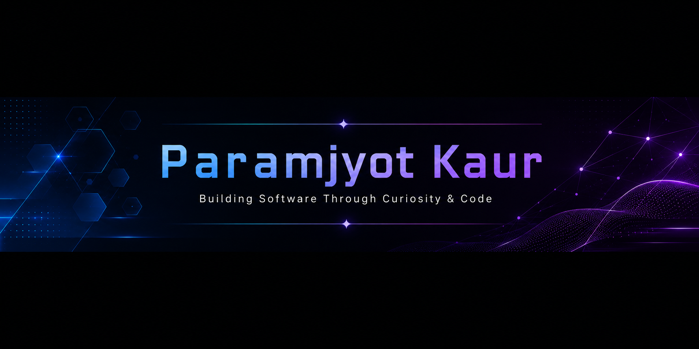

 

### Full Stack Developer • AI/ML Enthusiast

 

---

# 👨‍💻 About Me

🎓 **B.Tech Computer Science (AI/ML)** @ VIT Bhopal University

💻 I enjoy building modern web applications and intelligent software that solve real-world problems.

🚀 Interested in Full Stack Development, Artificial Intelligence, and Cloud Technologies.

🌱 Currently improving Data Structures & Algorithms while building production-ready applications.

## 💻 Tech Stack & Tools

  

## 🚀 Featured Projects

<table>

<tr>

<td width="50%" valign="top">

### 🏆 College Discovery Platform

Modern platform inspired by **Collegedunia** and **Careers360** for discovering, comparing, and saving colleges.

**✨ Highlights**

- Secure Authentication
- Smart Search & Filtering
- College Comparison
- Responsive UI

**Built with**

`React` • `TypeScript` • `TailwindCSS`

`Node.js` • `Prisma` • `PostgreSQL`

 

</td>

<td width="50%" valign="top">

### 🌿 Vibrant Workshop Hub

Interactive platform for discovering and managing educational workshops.

**✨ Highlights**

- Role-based Access
- Workshop Scheduling
- Instructor Dashboard
- Student Registration

**Built with**

`React` • `Express.js`

`PostgreSQL`

 

</td>

</tr>

<tr>

<td width="50%" valign="top">

### 🧪 Chemical Equipment Visualizer

Desktop application for visualizing and analyzing laboratory equipment through an interactive interface.

**✨ Highlights**

- Interactive Visualization
- Chemical Analysis
- Desktop Application
- User-friendly Interface

**Built with**

`JavaScript` • `Three.js`

`HTML` • `CSS`

 

</td>

<td width="50%" valign="top">

### 🌍 Earthquake Prediction System

Deep learning model trained on historical seismic data for earthquake prediction.

**✨ Highlights**

- Deep Learning
- Seismic Dataset
- Model Evaluation
- REST API Ready

**Built with**

`Python` • `TensorFlow`

`Scikit-Learn` • `Pandas`

 

</td>

</tr>

</table>

---

# 📊 GitHub Analytics

  

---

# 📈 Contribution Activity

---

# 🧩 DSA & Problem Solving

  
Strengthening problem-solving skills by consistently practicing Data Structures & Algorithms on LeetCode.

# 🐍 Contribution Snake

<picture>

<source
media="(prefers-color-scheme: dark)"
srcset="https://raw.githubusercontent.com/paramjyot2004/paramjyot2004/output/github-contribution-grid-snake-dark.svg"/>

<source
media="(prefers-color-scheme: light)"
srcset="https://raw.githubusercontent.com/paramjyot2004/paramjyot2004/output/github-contribution-grid-snake.svg"/>

</picture>

---

# 🤝 Let's Connect

---

⭐ Thanks for visiting my profile.

Feel free to connect, collaborate, or explore my repositories.

