# Hi there, I'm Paramjyot Kaur 👋

<table border="0" cellpadding="0" cellspacing="0" width="100%">
  <tr>
    <td width="48%" valign="top">
      
    </td>
    <td width="4%"></td>
    <td width="48%" valign="top">
      
    </td>
  </tr>
</table>

 

  

---

### 📌 Featured Projects

| Project | Description | Tech Stack |
| :--- | :--- | :--- |
| **[VitalWatch.AI](https://github.com/paramjyot2004)** | Healthcare monitoring platform with real-time anomaly detection. | React, Flask, TensorFlow |
| **[Earthquake Predictor](https://github.com/paramjyot2004)** | CNN + ANN predictive pipeline served via REST APIs on AWS. | Python, AWS, REST APIs |
| **[GAN Image Synthesis](https://github.com/paramjyot2004)** | Cartoon face synthesis and super-resolution model. | PyTorch, TensorFlow |

---

### 📫 Connect with Me
- 💼 **LinkedIn:** [linkedin.com/in/paramjyot-kaur](https://linkedin.com/in/)
- 📧 **GitHub:** [@paramjyot2004](https://github.com/paramjyot2004)
